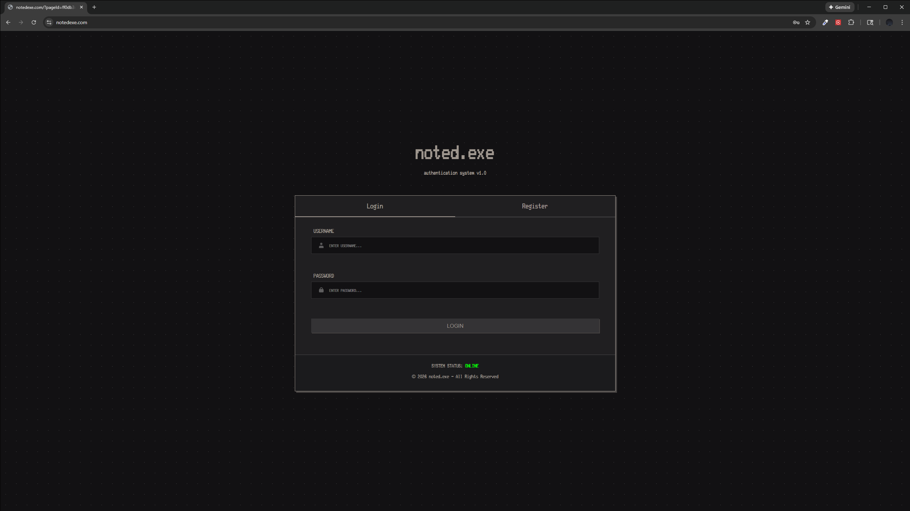
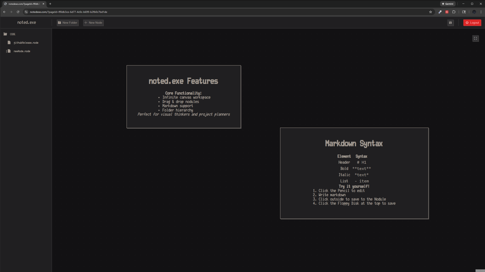

# noted.exe

A modern, infinite canvas note-taking application with folder organization and markdown support.


## Overview

**noted.exe** is a web-based note-taking application that combines hierarchical folder organization with an infinite canvas workspace. Create, organize, and visualize your notes as draggable, resizable "nodules" on an endless canvas. Perfect for visual thinkers, project planners, and anyone who wants to break free from linear note-taking.

### Key Features

- **Infinite Canvas**: Unlimited space to organize your thoughts visually
- **Folder Hierarchy**: Organize notes into folders and subfolders
- **Draggable Nodules**: Position notes anywhere on the canvas
- **Resizable Nodes**: Adjust note size to fit your content
- **Markdown Support**: Format your notes with full markdown syntax (tables, lists, headers, etc.)
- **User Authentication**: Secure JWT-based login system
- **Auto-Save**: Your work is automatically saved
- **Dark Theme**: Easy on the eyes for long work sessions

## Screenshots




## Tech Stack

### Frontend
- **TypeScript** - Type-safe JavaScript
- **React 19** - UI library
- **Next.js 16** - React framework with server-side rendering
- **SCSS** - Styling with Sass
- **@xyflow/react** - Canvas and node management
- **react-markdown** - Markdown rendering with GitHub Flavored Markdown support

### Backend
- **Spring Boot** - Java backend framework
- **PostgreSQL** - Database
- **JWT** - Authentication
- **Docker** - Containerization

## Getting Started

### Prerequisites

- Node.js 18+ and yarn
- Git

### Installation

1. **Clone the repository**
   ```bash
   git clone https://github.com/JohnArochaDev/noted.git
   cd noted
   ```

2. **Install dependencies**
   ```bash
   yarn install
   ```

4. **Run the development server**
   ```bash
   yarn run dev
   ```

5. **Open your browser**
   
   Navigate to [http://localhost:3000](http://localhost:3000)

### Available Scripts

- `npm run dev` - Start development server (with hot reload)
- `npm run build` - Build for production
- `npm start` - Start production server
- `npm run lint` - Run ESLint to check code quality

## Usage

### Getting Started

1. **Create an Account**: Click "Register" and create your credentials
2. **Login**: Use your credentials to access your workspace
3. **Create a Folder**: Click "New Folder" to create your first folder
4. **Create a Note**: Click "New File" after clickon on your new folder
5. **Add Nodules**: Click "New Node" on the canvas
6. **Write & Format**: Click a nodule, and click the pencil to edit, use markdown for formatting
7. **Organize**: Drag nodules around the canvas to organize visually
8. **Resize**: Click and drag nodule corners to resize
9. **Save**: Click the floppy disk above to save

### Folder Structure

- **Root Level**: Create top-level folders for major categories
- **Nested Folders**: Create subfolders within folders for organization
- **Note Files**: Each note file has its own infinite canvas
- **Hierarchy**: Every note must belong to a folder

### Markdown Support

Nodules support full markdown syntax (except images. coming soon!):

```markdown
# Headers
**Bold** and *italic* text
- Bullet lists
1. Numbered lists
[Links](https://example.com)
| Tables | Are | Supported |
|--------|-----|-----------|
| Cell   | Cell| Cell      |
```

### Keyboard Shortcuts

- `Drag` - Move nodules
- `Click + Drag corner` - Resize nodules
- `Click outside` - Save and exit edit mode

## Project Structure

```
noted/
├── app/
│   ├── Components/
│   │   ├── Canvas/          # Infinite canvas workspace
│   │   ├── SideBar/         # Folder tree navigation
│   │   ├── HotBar/          # Top action bar
│   │   ├── Login/           # Authentication UI
│   │   └── Nodule/          # Individual note nodes
│   ├── Context/             # React context for state
│   ├── styles/              # Global SCSS styles
│   └── page.tsx             # Main application entry
├── public/                  # Static assets
└── package.json             # Dependencies and scripts
```

## Configuration

### Backend Setup

This frontend requires a Spring Boot backend with the following endpoints:

- `POST /auth/signup` - User registration
- `POST /auth/login` - User authentication
- `GET /folders` - Get user's folders
- `POST /folders` - Create new folder
- `GET /nodules?parentId={id}` - Get nodules for a page
- `POST /nodules?parentId={id}` - Save nodules

See the backend repository for setup instructions.

[notedApi](https://github.com/JohnArochaDev/notedApi)

### Frontend (Netlify)

1. Connect your GitHub repository to Netlify
2. Set build command: `npm run build`
3. Set publish directory: `.next`
4. Add environment variables in Netlify dashboard
5. Deploy!

### Backend (Render)

See backend repository for deployment instructions.

## Contributing

Contributions are welcome! Please follow these steps:

1. Fork the repository
2. Create a feature branch (`git checkout -b feature/amazing-feature`)
3. Commit your changes (`git commit -m 'Add amazing feature'`)
4. Push to the branch (`git push origin feature/amazing-feature`)
5. Open a Pull Request

### Development Guidelines

- Follow TypeScript best practices
- Use ESLint rules provided
- Write clean, self-documenting code
- Test thoroughly before submitting PR

## Known Issues

- Canvas performance may degrade with 100+ nodules on screen
- Mobile support is not permitted

## Roadmap

- [ ] Image nodes / image MD
- [ ] Collaborative editing
- [ ] Export to PDF/PNG
- [ ] Color-coded nodules
- [ ] User web coloring
- [ ] Search functionality
- [ ] Mobile responsive design
- [ ] Undo/redo functionality
- [ ] Nodule linking/connections

## License

This project is licensed under a custom license that allows free use while preventing resale.

**What you CAN do:**
- ✅ Use it for free (personal or business)
- ✅ Use it internally in your company/team
- ✅ Modify it for your own needs
- ✅ Host your own instance
- ✅ Share and distribute it
- ✅ Use it for education/learning

**What you CANNOT do:**
- ❌ Sell it as a product
- ❌ Offer it as a paid service (SaaS)
- ❌ Charge money for access
- ❌ Monetize through ads/subscriptions
- ❌ Include it in a paid product

**Example Use Cases:**
- ✅ A startup uses it internally for their team notes (FREE)
- ✅ A developer modifies it for their personal workflow (FREE)
- ✅ A school uses it for student projects (FREE)
- ❌ A company sells "noted Pro" for $10/month (NOT ALLOWED)
- ❌ A hosting company offers "noted hosting" for profit (NOT ALLOWED)

See the [LICENSE](LICENSE) file for full details.

## Acknowledgments

- Built with [Next.js](https://nextjs.org/)
- Canvas powered by [@xyflow/react](https://reactflow.dev/)
- Markdown rendering by [react-markdown](https://github.com/remarkjs/react-markdown)

## Support

For issues, questions, or suggestions:
- Open an issue on GitHub
- Contact: your-email@example.com

---

**Made with by John Arocha II**

v1.0.0 - January 2026
